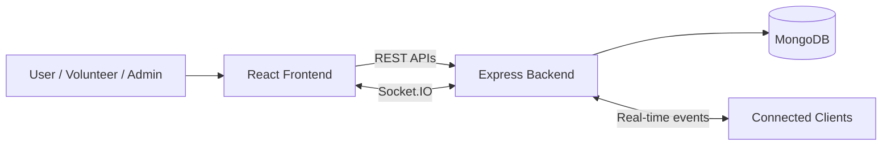
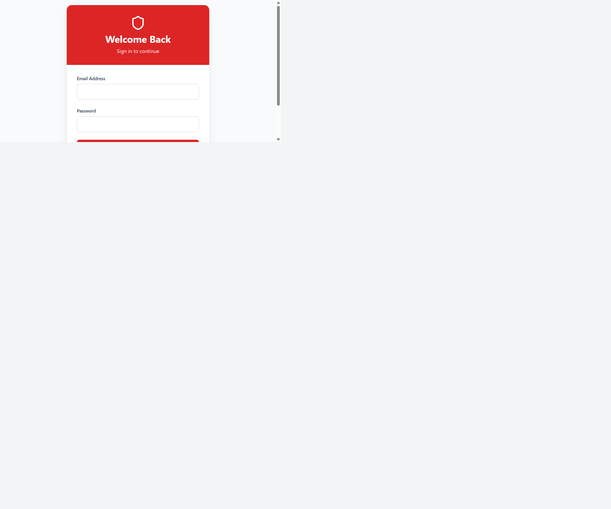
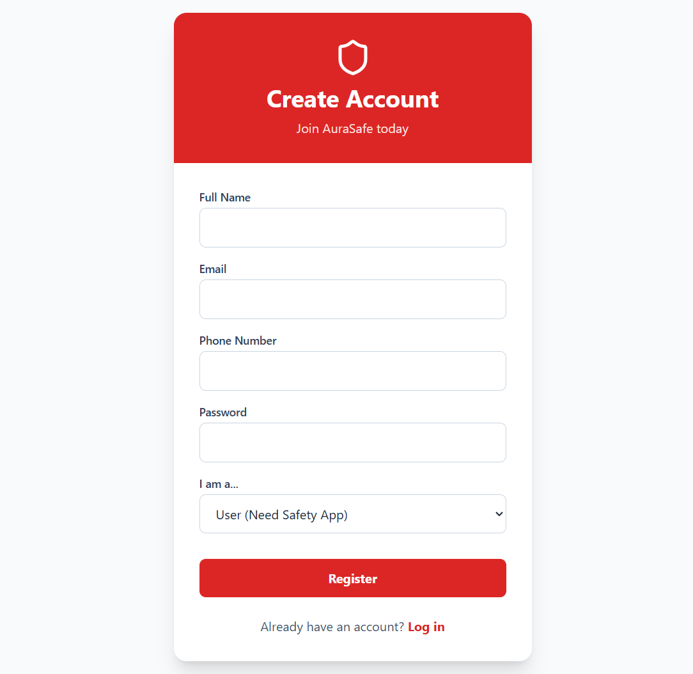
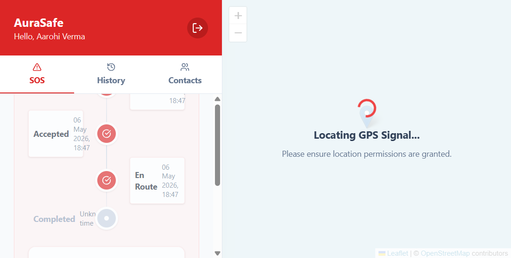
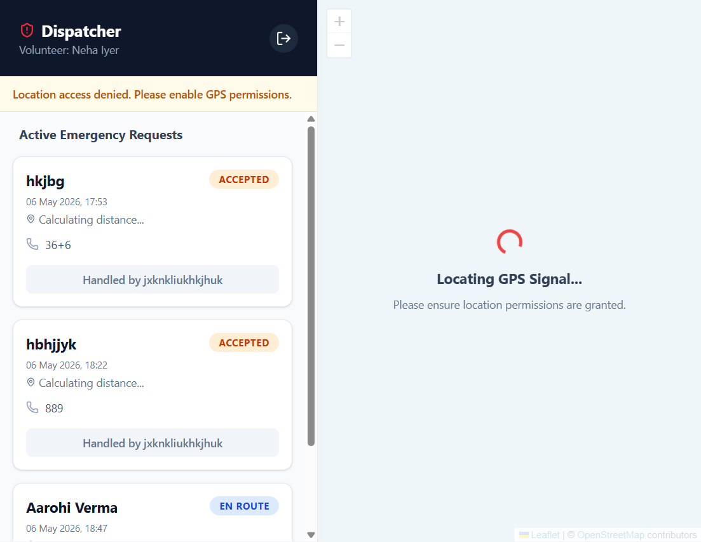
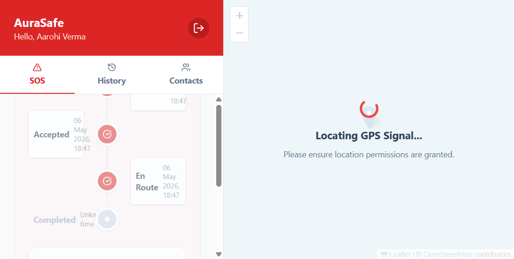
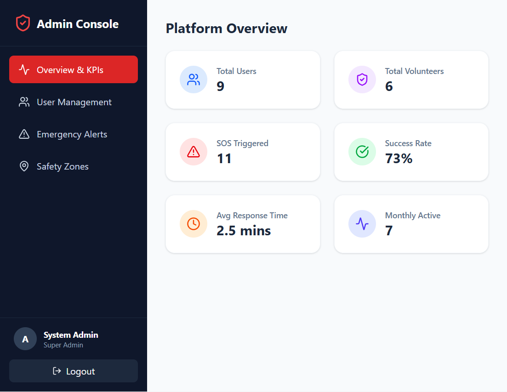
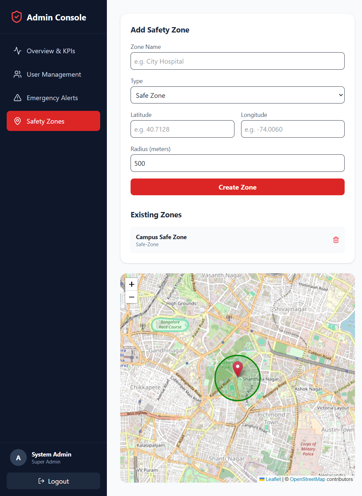

# Women Safety & Emergency Assistance Platform (AuraSafe)


AuraSafe is a full-stack emergency coordination platform built to help women trigger immediate SOS requests, share live location data, and receive rapid support from nearby verified volunteers. The system combines a safety-focused user experience with real-time communication, role-based access, and incident tracking so emergencies can be handled with speed and visibility.

The platform is designed around a simple flow: a user triggers SOS, the backend stores the alert in MongoDB, Socket.IO broadcasts the event to volunteers and admins, and the response lifecycle is tracked until the incident is completed. The result is a practical coordination layer for emergency response rather than a static reporting form.

## Feature Snapshot

| Area | Highlights |
|---|---|
| User Experience | SOS alerting, live tracking, emergency contacts, incident history |
| Volunteer Coordination | Alert queue, assignment workflow, location-aware response, status updates |
| Admin Oversight | Analytics, user verification, emergency logs, safety zones |
| Real-Time Layer | Socket.IO updates, volunteer presence, live incident synchronization |
| Security | JWT auth, bcrypt hashing, protected routes, role-based authorization |

## Key Features

### User Features
- One-tap SOS triggering with location capture.
- Live incident timeline showing alert creation, assignment, en-route status, and completion.
- Emergency contact management for trusted escalation.
- Alert history for reviewing previous incidents.
- Real-time updates while a request is active.

### Volunteer Features
- Live emergency queue for nearby SOS requests.
- Distance-aware response coordination using current geolocation data.
- Accept, en-route, and completed status flow for assigned alerts.
- Real-time volunteer availability and location sharing.
- Audio and visual alert cues for incoming emergencies.

### Admin Features
- Analytics dashboard with platform-level counts and response metrics.
- User and volunteer management with verification controls.
- Emergency log visibility across active and closed incidents.
- Safety zone management for hospitals, police stations, and safe areas.
- Live operational oversight through real-time socket updates.

### Real-Time Features
- Socket.IO-driven live updates across dashboards.
- Live volunteer presence tracking.
- Live user location updates during active incidents.
- Immediate emergency broadcast to connected responders.
- Cross-dashboard synchronization without manual refresh.

### Security Features
- JWT-based authentication.
- bcrypt password hashing.
- Protected routes for authenticated users.
- Role-based authorization for user, volunteer, and admin access.

## Tech Stack

### Frontend

| Technology | Purpose |
|---|---|
| React.js | Component-based user interface |
| Vite | Fast development and production builds |
| Tailwind CSS | Utility-first styling and responsive layouts |
| React Router | Client-side routing and protected navigation |
| React Leaflet | Map rendering and location visualization |

### Backend

| Technology | Purpose |
|---|---|
| Node.js | Runtime environment |
| Express.js | REST API server |
| Socket.IO | Real-time event delivery |
| JWT | Authentication and session validation |
| bcrypt | Secure password hashing |

### Database

| Technology | Purpose |
|---|---|
| MongoDB | Document database for users, alerts, and zones |
| Mongoose | Schema modeling and database access |

### Deployment

| Platform | Purpose |
|---|---|
| Vercel | Frontend hosting and public demo delivery |
| Render | Backend API hosting |
| MongoDB Atlas | Managed MongoDB Atlas cloud database configured for production. |

## Live Demo

The production deployment is available at the links below:

| Service | Production URL |
|---|---|
| Frontend Demo | https://women-safety-emergency-assistance-p.vercel.app |
| Backend API | https://aurasafe-backend.onrender.com |

## Backend API

The backend is hosted on Render and serves the REST API, authentication, Socket.IO events, and MongoDB-backed emergency workflows.

| Item | Value |
|---|---|
| Production API Base URL | https://aurasafe-backend.onrender.com |
| Real-time Socket URL | https://aurasafe-backend.onrender.com |
| Database | Managed MongoDB Atlas cloud database configured for production. |

## Production Deployment Architecture

AuraSafe uses a straightforward production stack for reliability and separation of concerns:

1. **Vercel** hosts the React frontend and serves the public demo URL.
2. **Render** hosts the Node.js and Express backend API, including Socket.IO.
3. **MongoDB Atlas** stores users, alerts, safety zones, and response history in a managed cloud database.

The frontend reads the backend endpoint from `VITE_API_URL`, so both axios requests and Socket.IO connections target the same deployed API in production while still falling back to localhost during local development.

## System Architecture

AuraSafe follows a clean client-server architecture:

1. The **frontend** collects user actions, renders dashboards, and communicates with the server through REST APIs and Socket.IO.
2. The **backend** validates requests, applies authentication and role checks, stores records, and broadcasts real-time events.
3. **MongoDB** stores users, alerts, emergency contacts, and safety zones.
4. **Socket.IO** keeps the user, volunteer, and admin interfaces synchronized in real time.



### Authentication Flow
- A user registers or logs in through the frontend.
- The backend validates the credentials, hashes passwords with bcrypt, and issues a JWT.
- The frontend stores the token and uses it for protected API requests.
- Protected routes and socket connections rely on the authenticated identity.

### SOS Event Flow
- The user taps SOS from the dashboard.
- The frontend captures the current GPS coordinates and sends the alert to the backend.
- The backend saves the alert in MongoDB.
- Socket.IO broadcasts the incident to connected volunteers and admins.
- The alert status updates in real time until resolution.

### Volunteer Coordination Flow
- Volunteers receive the incoming alert queue.
- A volunteer accepts the request and becomes the assigned responder.
- Status transitions move through accepted, en-route, and completed.
- The user dashboard reflects those changes immediately through live socket updates.

## User Roles

### User
- Trigger SOS alerts.
- Share live location during active incidents.
- Manage emergency contacts.
- View active alert status and past incident history.

### Volunteer
- Receive and respond to SOS alerts.
- Accept assignment and update incident status.
- Share live location with the platform.
- Support responders in real time with visibility into nearby incidents.

### Admin
- Monitor platform usage and response performance.
- Approve or reject volunteer accounts.
- Review all emergency records.
- Create and manage safety zones.

## Real-Time Emergency Workflow

1. User clicks SOS.
2. GPS location is captured.
3. Alert is saved in MongoDB.
4. Socket.IO broadcasts the alert.
5. Nearby volunteers are notified.
6. A volunteer accepts the request.
7. The user receives live status updates.
8. The incident is marked completed.

## Screenshots

### Authentication

**Login Page** - Secure JWT-based authentication interface


**Register Page** - User, volunteer, and admin registration


### User Dashboard

**User Dashboard** - SOS triggering, emergency contacts, and alert history


### Volunteer Operations

**Volunteer Dashboard** - Real-time alert queue and response coordination


**SOS Alert Workflow** - Live incident lifecycle from alert to completion


### Admin & Safety Management

**Admin Dashboard** - Platform analytics, user management, and operational oversight


**Analytics Dashboard** - Performance metrics and incident statistics


**Safety Zones Map** - Emergency locations and safe area management


## Live Demo

The deployment targets below point to the production services used by the platform:

| Target | URL |
|---|---|
| Frontend Demo | https://women-safety-emergency-assistance-p.vercel.app |
| Backend API | https://aurasafe-backend.onrender.com |
| MongoDB Atlas | Managed MongoDB Atlas cloud database configured for production. |

## Project Folder Structure

```text
women-safety-emergency-assistance-platform/
├── backend/
│   ├── config/
│   │   └── db.js
│   ├── middleware/
│   │   └── authMiddleware.js
│   ├── models/
│   │   ├── Alert.js
│   │   ├── SafetyZone.js
│   │   └── User.js
│   ├── routes/
│   │   ├── admin.js
│   │   ├── alerts.js
│   │   ├── auth.js
│   │   └── users.js
│   ├── index.js
│   ├── package.json
│   ├── seedAdmin.js
│   └── socket.js
├── frontend/
│   ├── public/
│   ├── src/
│   │   ├── assets/
│   │   ├── components/
│   │   │   ├── MapComponent.jsx
│   │   │   └── ToastViewport.jsx
│   │   ├── context/
│   │   │   ├── AuthContext.jsx
│   │   │   ├── SocketContext.jsx
│   │   │   └── ToastContext.jsx
│   │   ├── pages/
│   │   │   ├── AdminDashboard.jsx
│   │   │   ├── Landing.jsx
│   │   │   ├── Login.jsx
│   │   │   ├── Register.jsx
│   │   │   ├── UserDashboard.jsx
│   │   │   └── VolunteerDashboard.jsx
│   │   ├── utils/
│   │   │   ├── api.js
│   │   │   └── formatters.js
│   │   ├── App.jsx
│   │   ├── App.css
│   │   ├── index.css
│   │   └── main.jsx
│   ├── index.html
│   ├── package.json
│   └── vite.config.js
└── README.md
```

## Installation & Setup

### Prerequisites
- Node.js 18 or later.
- MongoDB running locally or a MongoDB Atlas connection string.
- Two terminal windows, one for the backend and one for the frontend.

### Backend Setup

1. Open a terminal in the `backend/` folder.
2. Install dependencies.
3. Create a `.env` file.
4. Start the backend server.

```bash
cd backend
npm install
```

Create `backend/.env`:

```env
PORT=5005
MONGO_URI=mongodb://127.0.0.1:27017/women_safety_platform
JWT_SECRET=your_super_secret_key
CLIENT_URL=http://localhost:5173
```

Start the backend:

```bash
node index.js
```

### Frontend Setup

1. Open a second terminal in the `frontend/` folder.
2. Install dependencies.
3. Start the Vite development server.

```bash
cd frontend
npm install
npm run dev
```

### Frontend Environment Variables

Create `frontend/.env` to define the backend URL used by Vite builds and local development:

```env
VITE_API_URL=https://aurasafe-backend.onrender.com
```

For local development, you can set `VITE_API_URL=http://localhost:5005`. The frontend automatically uses `import.meta.env.VITE_API_URL` for axios and Socket.IO connections.

## Environment Variables

### Backend

| Variable | Description |
|---|---|
| `PORT` | Port used by the Express server |
| `MONGO_URI` | MongoDB connection string |
| `JWT_SECRET` | Secret used to sign JWT tokens |
| `CLIENT_URL` | Frontend origin used for deployment and CORS coordination |

### Frontend

| Variable | Description |
|---|---|
| `VITE_API_URL` | Backend API base URL for deployment builds |

## API Endpoints

### Auth APIs

| Method | Endpoint | Description |
|---|---|---|
| `POST` | `/api/auth/register` | Register a new account |
| `POST` | `/api/auth/login` | Login and receive a JWT |

### Alert APIs

| Method | Endpoint | Description |
|---|---|---|
| `POST` | `/api/alerts` | Create a new SOS alert |
| `GET` | `/api/alerts/active` | Get the current active alert for the logged-in user |
| `GET` | `/api/alerts/queue` | Get the volunteer alert queue |
| `PUT` | `/api/alerts/:id/status` | Update alert status |
| `GET` | `/api/alerts/history` | Retrieve past incidents |

### Admin APIs

| Method | Endpoint | Description |
|---|---|---|
| `GET` | `/api/admin/stats` | Fetch platform analytics |
| `GET` | `/api/admin/users` | Fetch all users |
| `PUT` | `/api/admin/users/:id/verify` | Approve or reject a volunteer |
| `DELETE` | `/api/admin/users/:id` | Remove a user |
| `GET` | `/api/admin/alerts` | Fetch all emergency logs |

### Safety Zone APIs

| Method | Endpoint | Description |
|---|---|---|
| `GET` | `/api/admin/zones` | Fetch safety zones |
| `POST` | `/api/admin/zones` | Create a safety zone |
| `DELETE` | `/api/admin/zones/:id` | Delete a safety zone |

### User APIs

| Method | Endpoint | Description |
|---|---|---|
| `GET` | `/api/users/profile` | Get current user profile |
| `PUT` | `/api/users/contacts` | Update emergency contacts |
| `GET` | `/api/users/volunteers` | Fetch active volunteer users |

## Socket.IO Events

| Event | Direction | Description |
|---|---|---|
| `new-alert` | Server → Volunteers/Admins | Broadcasts a new SOS alert |
| `alert-assigned` | Server → User/Volunteer | Notifies that a volunteer has been assigned |
| `alert-status-updated` | Server → Connected clients | Broadcasts incident status changes |
| `volunteer-online` | Client → Server | Marks a volunteer as online |
| `volunteer-offline` | Client → Server | Marks a volunteer as offline |

Additional live events used by the platform include volunteer location updates, user location updates during active incidents, and user status change broadcasts.

## Security Features

AuraSafe uses a layered security model to protect user data and emergency workflows.

- **JWT authentication** secures user sessions and protects API access.
- **bcrypt password hashing** stores passwords safely in the database.
- **Protected routes** ensure only authenticated users can access private dashboards and APIs.
- **Role-based authorization** restricts admin and volunteer actions to the correct user types.
- **Socket authentication** validates live connections before real-time data is exchanged.

## Mobile Responsiveness

The interface is built with a mobile-first mindset.

- Dashboards adapt to smaller screens without breaking the incident flow.
- The SOS action is designed to remain prominent and touch-friendly.
- Cards, tables, and map panels reflow for smaller viewports.
- The experience remains usable on phones during active emergencies.

## Deployment Instructions

### Frontend on Vercel

1. Push the frontend code to GitHub.
2. Import the repository into Vercel.
3. Set the build command to `npm run build`.
4. Set the output directory to `dist`.
5. Add `VITE_API_URL=https://aurasafe-backend.onrender.com` in the Vercel environment variables.
6. Redeploy to confirm the frontend points to the production backend.

### Backend on Render

1. Push the backend code to GitHub.
2. Create a new Render Web Service.
3. Set the start command to `node index.js`.
4. Add `PORT`, `MONGO_URI`, `JWT_SECRET`, and `CLIENT_URL` in Render environment settings.
5. Make sure `CLIENT_URL` includes the Vercel production domain so CORS and Socket.IO remain aligned.
6. Confirm the service can reach MongoDB Atlas.

### MongoDB Atlas Setup

1. Create a cluster in MongoDB Atlas.
2. Create a database user and password.
3. Allow network access for your deployment environment.
4. Copy the Atlas connection string into `MONGO_URI`.
5. Test the backend connection before deploying the frontend.

## Contributors

| Contributor | Role |
|---|---|
| Project Author | Full-stack development, UI implementation, backend APIs, real-time coordination, deployment preparation |

## Future Enhancements

The following enhancements can be added later without changing the core platform direction:

- Police integration.
- Wearable device support.
- Voice SOS activation.
- AI-based risk detection.

## Conclusion

AuraSafe is designed to turn a stressful emergency into a coordinated, traceable response workflow. By combining SOS triggering, live location tracking, volunteer assignment, and real-time dashboard synchronization, the platform improves response visibility and reduces the delay between incident reporting and assistance.

The project demonstrates a practical full-stack architecture for emergency coordination and is suitable for internship evaluation because it shows real product thinking: authentication, role-based access, live updates, analytics, map interaction, and operational cleanup. It is not just a demo interface; it is a safety-focused system built to support faster decision-making and better incident handling in real time.
